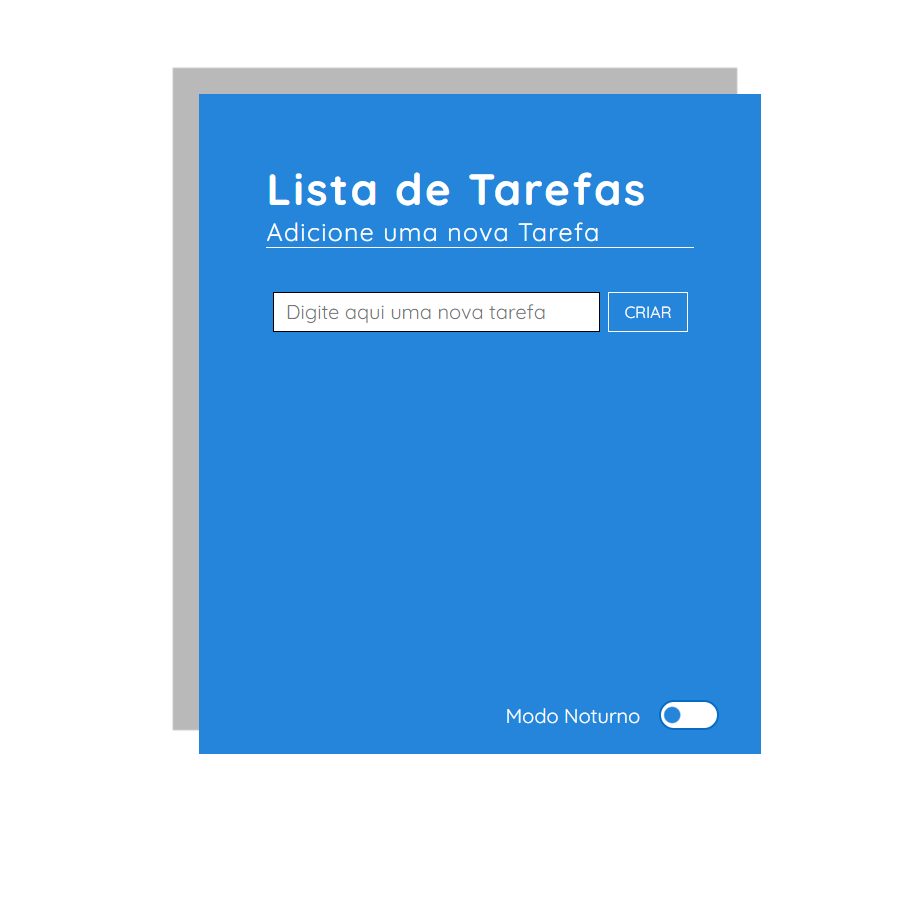
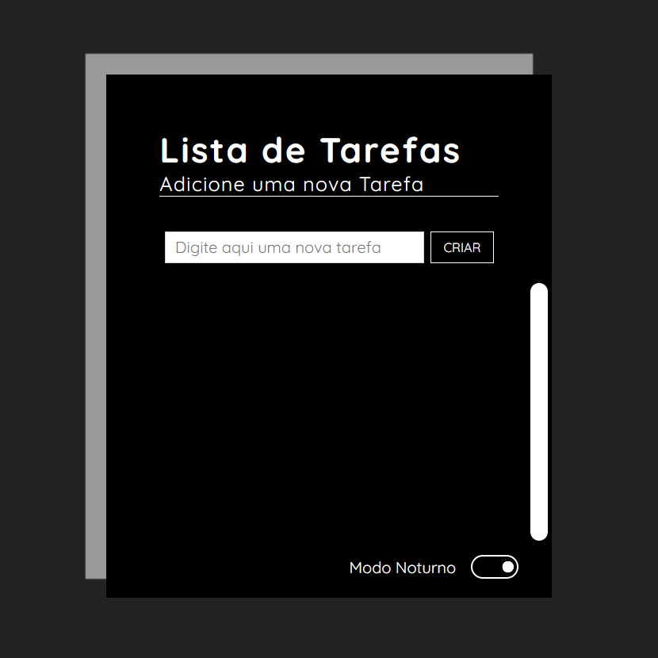

<h1 align="center">ToDO List</h1>

  <a href="#-Deployment">Deployment</a>&nbsp;&nbsp;|&nbsp;&nbsp;
  <a href="#-Tecnologias">Tecnologias</a>&nbsp;&nbsp;|&nbsp;&nbsp;
  <a href="#-Projeto">Projeto</a>&nbsp;&nbsp;|&nbsp;&nbsp;
  <a href="#-Recursos">Recursos</a>&nbsp;&nbsp;&nbsp;&nbsp;

## 🌐 Deployment

Você pode visualizar o deploy do projeto através desse link:
 🟢[GitHub Pages](https://carecsnay.github.io/ToDO-List/) 

  <h3 align="center">Light Theme</h3>
  
  <h3 align="center">Dark Theme</h3>
  

## 🚀 Tecnologias

Esse projeto foi desenvolvido com as seguintes tecnologias:

- HTML5 
- CSS3
- JS

## 💻 Projeto

Este é um clone do projeto Awax, criado com o objetivo de aprimorar meus conhecimentos em JavaScript, HTML e CSS. O Awax é um site responsivo e moderno, projetado para uma empresa fictícia de tecnologia, que oferece serviços de desenvolvimento web e design.

## 🧠 Recursos
- Tema Dark/Light.
- Funcionalidades criar, finalizar ou remover tarefas. 
- ❌ Persistência de dados.

---

Todos os direitos reservados.
